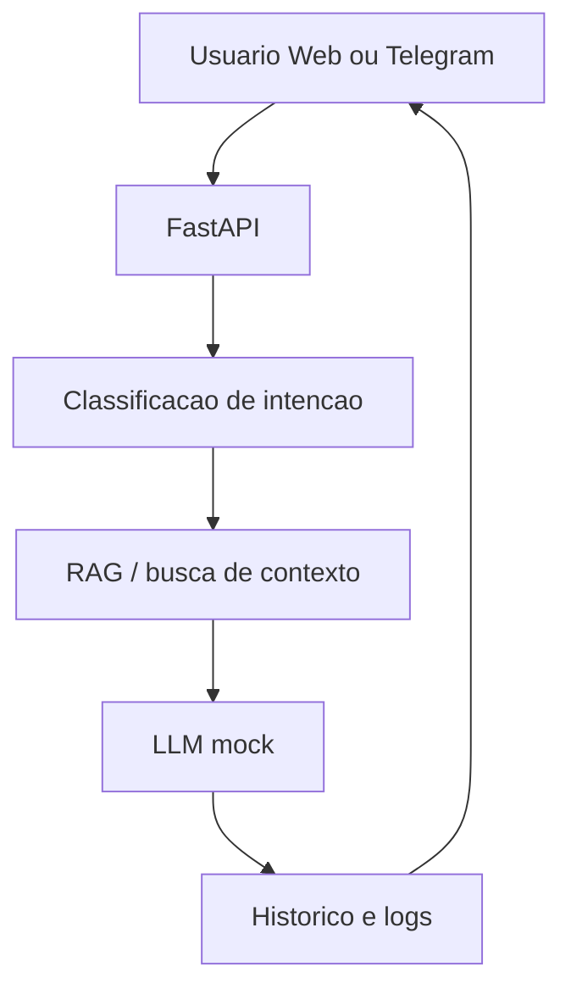

# Arquitetura da POC

## Visao

A POC usa uma API FastAPI como centro da solucao. Web Chat e Telegram chamam o mesmo fluxo de atendimento. O backend classifica intencao, recupera contexto, gera resposta controlada, aplica fallback, persiste historico e registra feedback.

## Camadas

- Frontend: React + TypeScript, chat, fontes, feedback e estado de atendimento.
- API: rotas FastAPI e schemas Pydantic.
- Application: orquestracao do caso de uso de atendimento.
- Domain: modelos de atendimento, mensagem, documento, fonte e intencao.
- AI: classificador simples, RAG inicial, prompt/LLM mock.
- Infrastructure: repositorio em memoria, MCP simulado e futuros adaptadores MySQL/Qdrant/Telegram.

## Fluxo

## Proximas trocas planejadas

- `InMemoryRepository` por repositorios MySQL.
- `SimpleRetriever` por Qdrant.
- `MockLLMGateway` por gateway de LLM real.
- Fluxo imperativo por LangGraph depois do MVP Web.
