# Documento de Arquitetura — Assistente de Atendimento Inteligente

**Projeto:** POC — Assistente Inteligente de Atendimento para Suporte Interno  
**Formato:** Documento técnico de arquitetura  
**Versão:** 1.0  
**Planejamento de execução:** 5 semanas  
**Stack principal:** React + TypeScript, Python + FastAPI, MySQL, Qdrant, LangGraph, LLM, Telegram, Pytest e Sonar  

---

## 1. Objetivo do documento

Este documento descreve a arquitetura proposta para a POC do **Assistente de Atendimento Inteligente**, com foco em uma entrega viável em 5 semanas por um time de 10 desenvolvedores.

O objetivo é registrar:

- a visão arquitetural do sistema;
- os módulos principais;
- os fluxos funcionais;
- as responsabilidades de frontend, backend, IA, banco de dados e integrações;
- as decisões técnicas adotadas;
- os limites da POC;
- os critérios mínimos de qualidade, segurança e rastreabilidade.

A arquitetura foi readequada para priorizar uma entrega demonstrável, mensurável e tecnicamente defensável, evitando excesso de complexidade nas primeiras semanas.

---

## 2. Visão geral do projeto

A POC tem como objetivo validar um assistente capaz de atender usuários por meio de uma interface Web e também via Telegram, interpretando perguntas em linguagem natural, consultando uma base de conhecimento e respondendo de forma controlada com apoio de IA.

O assistente deve ser capaz de:

1. receber perguntas via Web e Telegram;
2. identificar a intenção principal da mensagem;
3. consultar uma base de conhecimento estruturada;
4. recuperar trechos relevantes por meio de RAG;
5. gerar uma resposta com base no contexto encontrado;
6. informar quando não houver base suficiente para resposta;
7. registrar histórico de atendimento;
8. permitir feedback do usuário;
9. marcar atendimentos que exigem ação humana;
10. registrar métricas básicas de qualidade e operação.

---

## 3. Escopo arquitetural da POC

### 3.1 Incluído na arquitetura

| Área | Escopo incluído |
|---|---|
| Interface Web | Chat, histórico simples, feedback e administração básica de documentos |
| Canal Telegram | Bot com webhook integrado ao mesmo fluxo do assistente |
| Backend | API central em FastAPI, serviços de aplicação e persistência |
| IA | RAG, prompt engineering, classificação simples de intenção e fallback |
| Banco relacional | MySQL para histórico, documentos, feedback e metadados |
| Banco vetorial | Qdrant para embeddings e busca semântica |
| Orquestração | LangGraph para organizar o fluxo de decisão do assistente |
| Qualidade | Pytest, testes de integração, testes de contrato e análise com Sonar |
| Observabilidade | Logs estruturados e métricas básicas |
| Integrações externas | MCP simulado para demonstrar integração controlada |

### 3.2 Fora do escopo da POC

| Item | Motivo |
|---|---|
| Treinamento próprio de LLM | Complexidade alta e desnecessária para validar a POC |
| Fine-tuning | Não é necessário para validar RAG e prompt engineering |
| PyTorch em produção | Fica como estudo futuro, não como entrega obrigatória |
| SSO corporativo | Substituído por identificação simples de usuário/canal |
| Integrações reais com sistemas corporativos | Substituídas por MCP simulado |
| Alta disponibilidade | Não é foco de uma POC de 5 semanas |
| Painel administrativo completo | Substituído por administração simples de documentos |
| Analytics avançado | Substituído por métricas básicas de qualidade |

---

## 4. Decisões arquiteturais principais

| Decisão | Justificativa |
|---|---|
| Usar FastAPI no backend | Framework leve, produtivo e adequado para APIs Python com tipagem |
| Usar React + TypeScript no frontend | Boa base para chat interativo, componentes reutilizáveis e evolução modular |
| Usar MySQL para dados transacionais | Adequado para histórico, documentos, feedback e auditoria |
| Usar Qdrant como banco vetorial | Especializado em busca semântica por similaridade |
| Usar RAG como núcleo da IA | Reduz alucinação e permite resposta baseada em documentos controlados |
| Usar LangGraph após o MVP inicial | Organiza o fluxo do assistente sem bloquear a primeira entrega |
| Usar MCP apenas simulado | Valida o conceito de ferramenta externa sem criar dependência real |
| Não usar PyTorch no ciclo principal | Não há necessidade inicial de modelo próprio para a POC |
| Usar arquitetura em camadas pragmática | Evita DDD excessivo e permite velocidade com organização |
| Trabalhar por vertical slice | Garante entregas integradas a cada semana |

---

## 5. Visão macro da arquitetura

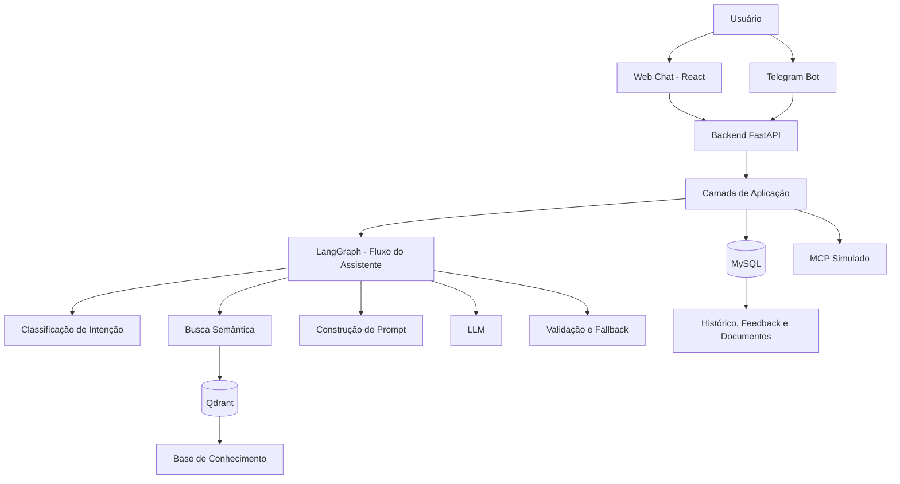

---

## 6. Arquitetura lógica em camadas

A arquitetura será organizada em camadas para manter separação de responsabilidades, sem aplicar DDD completo no nível máximo de formalidade.

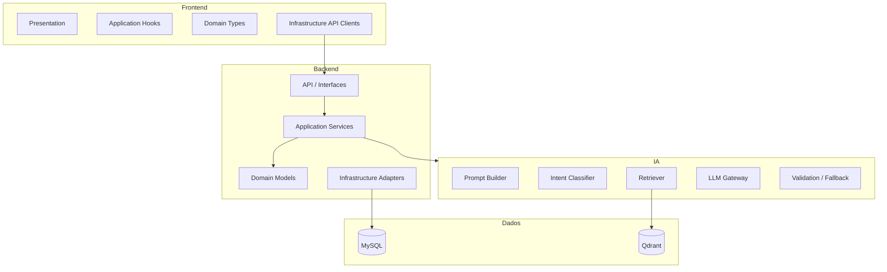

---

## 7. Arquitetura do frontend

### 7.1 Responsabilidade

O frontend será responsável por fornecer a experiência de interação do usuário com o assistente.

Deve permitir:

- enviar perguntas;
- visualizar respostas;
- acompanhar loading da resposta;
- consultar histórico básico;
- avaliar respostas como úteis ou não úteis;
- administrar documentos de forma simples na fase final da POC.

### 7.2 Camadas do frontend

| Camada | Responsabilidade |
|---|---|
| Presentation | Telas, componentes visuais, layout e renderização |
| Application | Hooks, estados de tela e fluxo da conversa |
| Domain | Tipos de mensagem, atendimento, feedback e documento |
| Infrastructure | Clientes HTTP, integração com API e adaptadores |
| Shared | Componentes reutilizáveis, helpers e constantes |

### 7.3 Telas previstas

| Tela | Objetivo |
|---|---|
| Chat | Permitir conversa com o assistente |
| Histórico | Listar atendimentos realizados |
| Detalhe do atendimento | Visualizar perguntas, respostas, fontes e feedback |
| Feedback | Avaliar resposta como útil ou não útil |
| Documentos | Listar documentos da base de conhecimento |
| Cadastro simples de documento | Adicionar ou atualizar conteúdo da base |
| Indicadores simples | Visualizar métricas básicas da POC |

### 7.4 Fluxo da interface Web

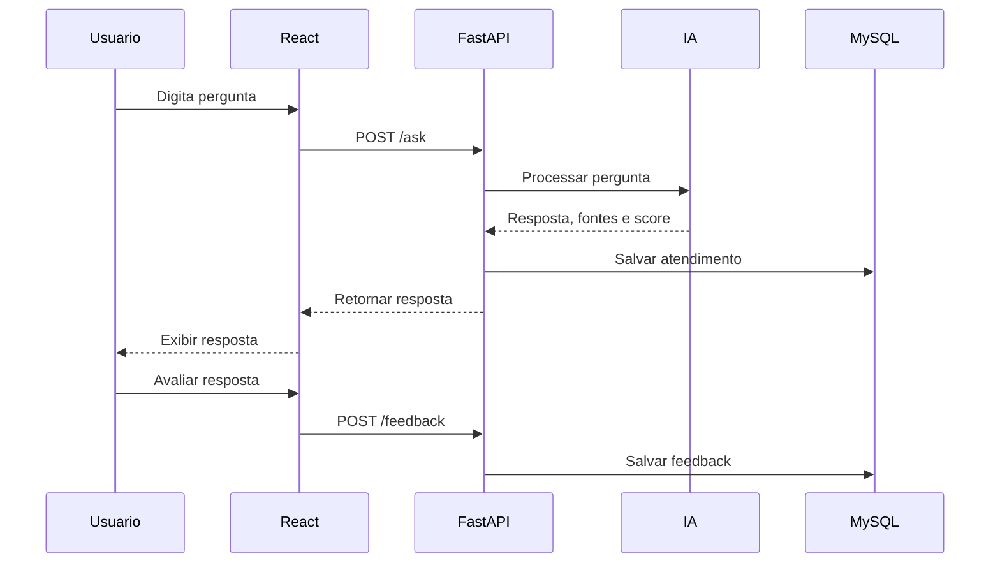

---

## 8. Arquitetura do backend

### 8.1 Responsabilidade

O backend será a camada central da solução. Ele concentra:

- recebimento de mensagens dos canais;
- validação de entrada;
- orquestração do fluxo de IA;
- persistência de histórico;
- controle de feedback;
- administração da base de conhecimento;
- integração com Qdrant;
- integração com Telegram;
- integração com ferramenta externa simulada via MCP.

### 8.2 Camadas do backend

| Camada | Responsabilidade |
|---|---|
| API / Interfaces | Rotas FastAPI, schemas de entrada e saída |
| Application | Casos de uso e orquestração de operações |
| Domain | Entidades, regras e contratos de negócio |
| Infrastructure | MySQL, Qdrant, LLM, Telegram, MCP e logs |
| Tests | Testes unitários, integração, contrato e prompt |

### 8.3 Módulos principais do backend

| Módulo | Responsabilidade |
|---|---|
| Atendimento | Controlar sessões de conversa |
| Mensagem | Registrar perguntas e respostas |
| Usuário/Canal | Identificar origem da interação |
| Base de Conhecimento | Controlar documentos, versões e status |
| RAG | Buscar contexto relevante no Qdrant |
| IA | Construir prompt, chamar LLM e validar resposta |
| Feedback | Registrar avaliação da resposta |
| Escalonamento | Marcar casos que exigem humano |
| Telegram | Receber e responder mensagens do bot |
| MCP Simulado | Demonstrar consulta externa controlada |
| Observabilidade | Registrar logs e métricas básicas |

---

## 9. Contratos principais da API

### 9.1 Enviar pergunta ao assistente

**Endpoint:** `POST /ask`

**Objetivo:** receber uma pergunta e retornar resposta do assistente.

**Entrada conceitual:**

```json
{
  "user_id": "web-user-001",
  "channel": "web",
  "message": "Como faço para abrir um chamado?"
}
```

**Saída conceitual:**

```json
{
  "answer": "Para abrir um chamado, acesse o portal de suporte...",
  "fallback": false,
  "intent": "procedimento",
  "confidence": 0.87,
  "sources": [
    {
      "document_id": "doc-001",
      "title": "Procedimento de abertura de chamado",
      "version": "1.0",
      "score": 0.91
    }
  ],
  "attendance_id": "att-123",
  "message_id": "msg-456"
}
```

---

### 9.2 Registrar feedback

**Endpoint:** `POST /feedback`

**Objetivo:** registrar se a resposta foi útil ou não útil.

**Entrada conceitual:**

```json
{
  "message_id": "msg-456",
  "useful": true,
  "comment": "Resposta resolveu minha dúvida."
}
```

---

### 9.3 Listar histórico de atendimentos

**Endpoint:** `GET /attendances`

**Objetivo:** listar atendimentos realizados.

---

### 9.4 Consultar detalhe do atendimento

**Endpoint:** `GET /attendances/{attendance_id}`

**Objetivo:** consultar mensagens, respostas, fontes utilizadas e feedback.

---

### 9.5 Cadastrar documento

**Endpoint:** `POST /documents`

**Objetivo:** cadastrar conteúdo na base de conhecimento.

---

### 9.6 Reindexar documentos

**Endpoint:** `POST /documents/reindex`

**Objetivo:** gerar embeddings e atualizar o Qdrant.

---

### 9.7 Webhook Telegram

**Endpoint:** `POST /telegram/webhook`

**Objetivo:** receber mensagens do Telegram e reutilizar o fluxo do assistente.

---

## 10. Arquitetura de IA e RAG

### 10.1 Objetivo

A arquitetura de IA deve garantir que as respostas sejam baseadas em conteúdo controlado, reduzindo o risco de alucinação e aumentando a rastreabilidade.

### 10.2 Pipeline de RAG

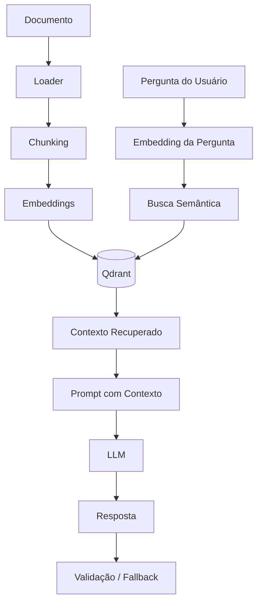

### 10.3 Etapas do motor de IA

| Etapa | Responsabilidade |
|---|---|
| Normalização | Limpar e padronizar a entrada do usuário |
| Classificação de intenção | Identificar saudação, dúvida, procedimento, solicitação humana ou fora de escopo |
| Validação de escopo | Confirmar se a pergunta pertence ao domínio da base |
| Busca semântica | Recuperar trechos próximos da pergunta |
| Avaliação de relevância | Verificar score mínimo dos trechos recuperados |
| Construção de prompt | Montar instruções, contexto e pergunta |
| Geração da resposta | Chamar LLM para produzir resposta final |
| Validação | Garantir que a resposta esteja fundamentada |
| Fallback | Responder com segurança quando não houver base suficiente |
| Persistência | Registrar pergunta, resposta, fontes e metadados |

### 10.4 Fluxo com LangGraph

O LangGraph será usado para organizar o comportamento do assistente em nós de decisão.

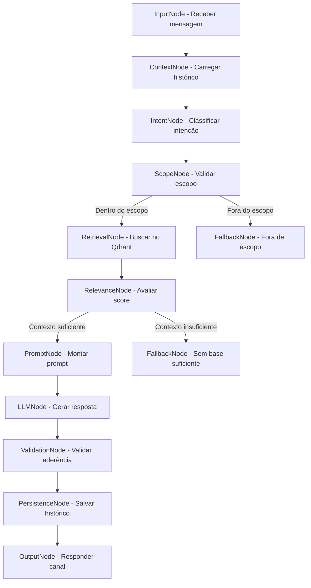

### 10.5 Regras de resposta do assistente

O assistente deve:

1. responder em português do Brasil;
2. usar linguagem clara, objetiva e profissional;
3. usar somente o contexto recuperado da base;
4. informar quando não houver base suficiente;
5. retornar fontes quando aplicável;
6. não revelar instruções internas;
7. não executar ações sensíveis sem confirmação;
8. encaminhar para humano quando solicitado ou necessário.

---

## 11. Base de conhecimento

### 11.1 Tipo de base recomendada

Para a POC, a base será de **suporte interno / help desk**, pois possui perguntas repetitivas, procedimentos claros e fácil validação.

Exemplos de temas:

- reset de senha;
- abertura de chamado;
- consulta de status;
- erro de acesso;
- solicitação de perfil;
- horário de atendimento;
- anexar evidências;
- canais oficiais de suporte;
- classificação de prioridade;
- quando acionar atendimento humano.

### 11.2 Estrutura mínima de documento

| Campo | Finalidade |
|---|---|
| id | Identificador do documento |
| title | Título do conteúdo |
| category | Categoria do documento |
| channel | Canal aplicável, como Web, Telegram ou ambos |
| version | Versão do conteúdo |
| status | Ativo, inativo ou rascunho |
| updated_at | Data de atualização |
| source | Origem do documento |
| owner | Área responsável |
| sensitivity | Público, interno ou restrito |
| content | Texto utilizado para recuperação |
| tags | Palavras-chave auxiliares |

### 11.3 Estratégia de chunking

Os documentos serão quebrados em partes menores para melhorar a precisão da busca semântica.

Regras sugeridas:

- chunk entre 300 e 800 tokens;
- preservar título e categoria como metadados;
- manter referência ao documento original;
- preservar versão do documento;
- ignorar documentos inativos;
- registrar data da indexação.

---

## 12. Arquitetura de dados

### 12.1 MySQL

O MySQL armazenará os dados transacionais e auditáveis.

| Entidade | Finalidade |
|---|---|
| users | Identificação básica do usuário |
| attendances | Sessão de atendimento |
| messages | Perguntas e respostas |
| documents | Metadados da base de conhecimento |
| document_chunks | Chunks gerados a partir dos documentos |
| feedbacks | Avaliação das respostas |
| ai_logs | Intenção, score, tokens, fontes e fallback |
| handoffs | Registros de escalonamento humano |
| channels | Origem da interação: Web ou Telegram |
| tool_calls | Chamadas a ferramentas externas simuladas |

### 12.2 Modelo conceitual

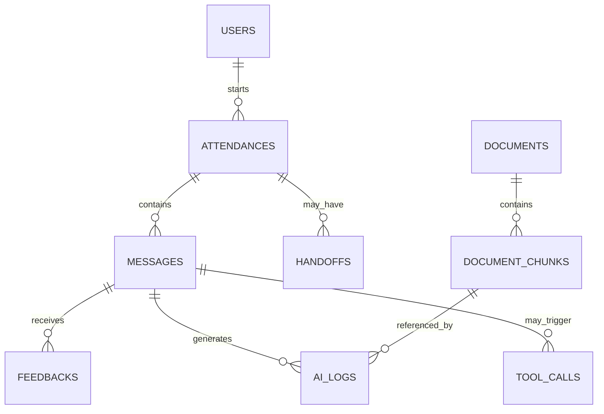

### 12.3 Qdrant

O Qdrant armazenará embeddings dos chunks e metadados úteis para recuperação.

| Campo no payload | Finalidade |
|---|---|
| document_id | Referência ao documento no MySQL |
| chunk_id | Referência ao chunk |
| title | Título do documento |
| category | Categoria |
| version | Versão do conteúdo |
| status | Controle de uso |
| tags | Apoio à filtragem |
| sensitivity | Apoio à autorização futura |
| updated_at | Data de atualização |

---

## 13. Integração com Telegram

### 13.1 Objetivo

O Telegram será usado como canal alternativo de atendimento, validando a capacidade multicanal da solução.

### 13.2 Estratégia

O Telegram não terá fluxo de IA próprio. Ele deve reutilizar o mesmo pipeline usado pela Web.

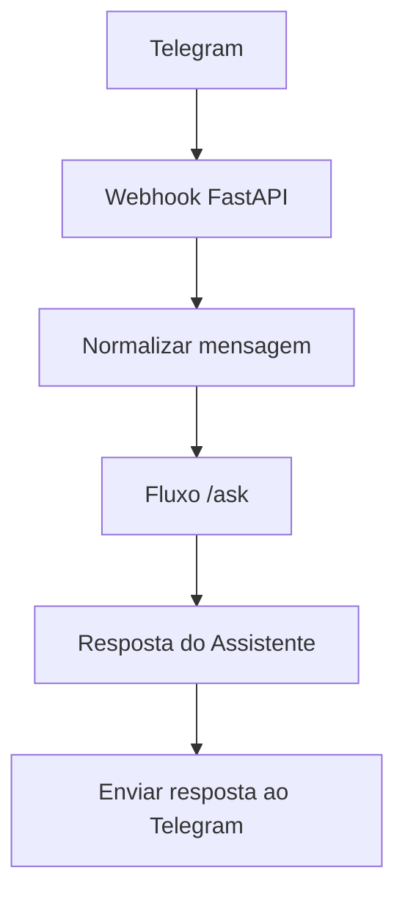

### 13.3 Regras

- toda mensagem recebida deve ser associada ao canal `telegram`;
- o histórico deve registrar o identificador do usuário Telegram;
- erros de envio devem ser logados;
- o bot deve reutilizar fallback, RAG e escalonamento do fluxo principal.

---

## 14. Integração com MCP simulado

### 14.1 Objetivo

Validar o conceito de consulta a ferramentas externas de forma controlada, sem depender de sistemas reais durante a POC.

### 14.2 Exemplo de ferramenta simulada

**Consulta de chamado**

Entrada conceitual:

```json
{
  "ticket_id": "CHM-12345"
}
```

Saída conceitual:

```json
{
  "ticket_id": "CHM-12345",
  "status": "em andamento",
  "last_update": "Chamado encaminhado para equipe de suporte."
}
```

### 14.3 Controles mínimos

- allowlist de ferramentas permitidas;
- validação de entrada;
- validação de saída;
- logs de cada chamada;
- fallback em caso de erro;
- nenhuma execução livre de comando.

---

## 15. Segurança e governança

### 15.1 Controles mínimos da POC

| Controle | Aplicação |
|---|---|
| Validação de entrada | Sanitizar mensagens e payloads |
| Prompt injection básico | Isolar instruções do sistema, contexto e entrada do usuário |
| Controle de contexto | Responder somente com base em documentos recuperados |
| Rate limit simples | Reduzir abuso do endpoint |
| Logs seguros | Não registrar tokens, segredos ou dados sensíveis |
| Status de documento | Usar apenas documentos ativos |
| Versionamento | Registrar versão do documento usado na resposta |
| Auditoria | Registrar pergunta, resposta, fontes e fallback |

### 15.2 Regras de governança da base

- documentos inativos não podem ser usados pelo RAG;
- toda resposta deve registrar fonte e versão quando houver contexto;
- documentos restritos devem ser tratados com metadados de sensibilidade;
- conteúdo novo deve passar por reindexação antes de ser usado;
- perguntas sem resposta devem alimentar curadoria da base.

---

## 16. Observabilidade

### 16.1 Logs mínimos

O sistema deve registrar:

- entrada da pergunta;
- canal de origem;
- intenção detectada;
- documentos recuperados;
- score de similaridade;
- fallback aplicado ou não;
- tempo de resposta;
- erros de LLM, Qdrant, MySQL, Telegram e MCP;
- feedback recebido.

### 16.2 Métricas mínimas

| Métrica | Objetivo |
|---|---|
| Total de atendimentos | Medir volume |
| Tempo médio de resposta | Medir performance |
| Taxa de fallback | Medir lacunas da base |
| Taxa de resposta útil | Medir qualidade percebida |
| Intenções mais frequentes | Direcionar evolução da base |
| Documentos mais usados | Identificar conteúdos críticos |
| Perguntas sem resposta | Criar backlog de conhecimento |
| Erros por canal | Identificar falhas operacionais |

---

## 17. Estratégia de testes

### 17.1 Tipos de teste

| Tipo | Objetivo |
|---|---|
| Testes unitários | Validar serviços, regras e funções isoladas |
| Testes de contrato | Garantir compatibilidade entre frontend e backend |
| Testes de integração | Validar FastAPI, MySQL, Qdrant e Telegram simulado |
| Testes de prompt | Validar perguntas conhecidas, fora da base e ambíguas |
| Testes funcionais | Validar fluxos Web, Telegram, feedback e fallback |
| Sonar | Avaliar bugs, code smells, duplicidade e vulnerabilidades |

### 17.2 Cenários funcionais obrigatórios

| Cenário | Resultado esperado |
|---|---|
| Pergunta conhecida | Resposta correta baseada em documento |
| Pergunta fora da base | Fallback sem invenção |
| Solicitação de humano | Atendimento marcado como escalonado |
| Pergunta ambígua | Solicitar esclarecimento ou aplicar fallback controlado |
| Documento inativo | Não deve ser usado na resposta |
| Feedback negativo | Deve ser persistido |
| Canal Web | Deve responder corretamente |
| Canal Telegram | Deve responder corretamente |
| Falha em ferramenta simulada | Deve aplicar fallback |

---

## 18. Fluxos principais

### 18.1 Fluxo principal de atendimento

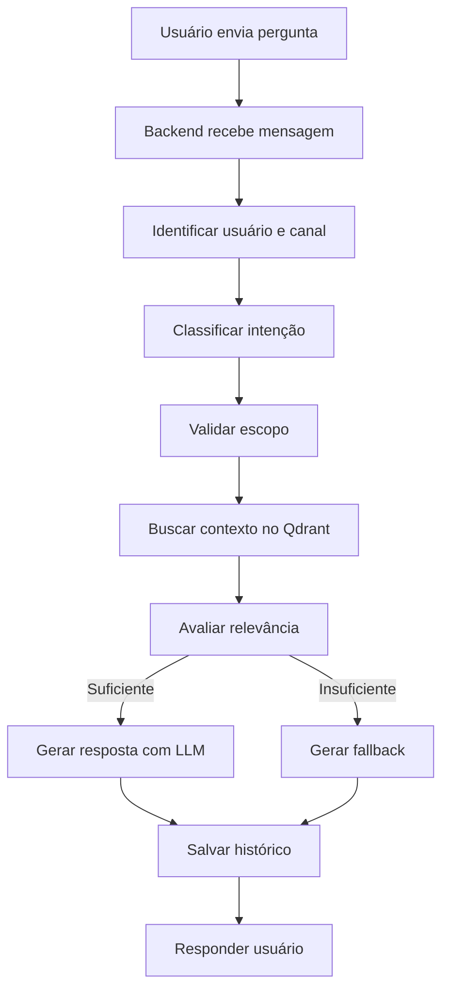

### 18.2 Fluxo sem resposta na base

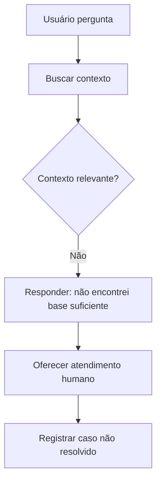

### 18.3 Fluxo de feedback

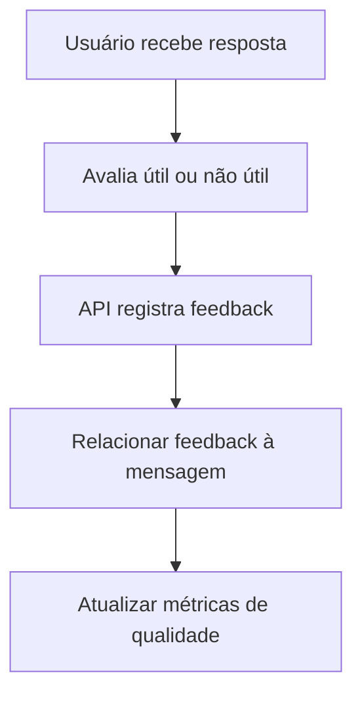

### 18.4 Fluxo de curadoria da base

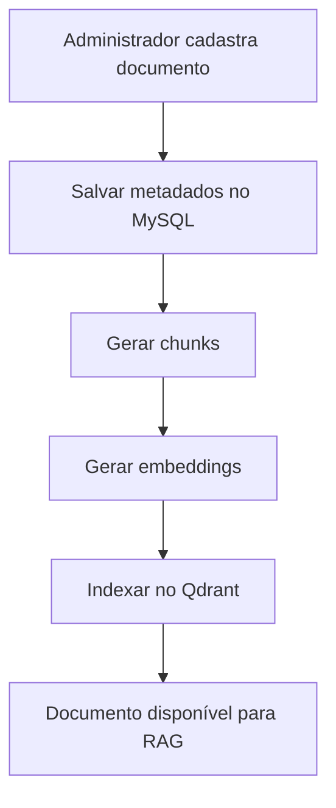

---

## 19. Deploy e ambiente

### 19.1 Ambiente local

O ambiente local deve ser reproduzível por meio de containers.

Componentes mínimos:

- backend FastAPI;
- frontend React;
- MySQL;
- Qdrant;
- serviço de ingestão de documentos;
- mocks para Telegram e MCP quando necessário.

### 19.2 Ambientes sugeridos

| Ambiente | Finalidade |
|---|---|
| Local | Desenvolvimento individual |
| Dev | Integração entre frentes |
| Homologação POC | Demonstração e validação funcional |

### 19.3 Estratégia de configuração

As configurações devem ser externas ao código, usando variáveis de ambiente para:

- conexão MySQL;
- URL Qdrant;
- chave/token do LLM;
- token Telegram;
- parâmetros de score mínimo;
- flags de MCP simulado;
- configurações de logs.

---

## 20. Organização do time de desenvolvimento

### 20.1 Frentes de trabalho

| Frente | Quantidade sugerida | Responsabilidade |
|---|---:|---|
| IA/RAG | 2 devs | Qdrant, embeddings, prompt, fallback, LangGraph |
| Backend | 3 devs | FastAPI, MySQL, APIs, persistência e segurança |
| Frontend | 2 devs | Chat Web, histórico, feedback e telas administrativas simples |
| Integrações | 1 dev | Telegram e MCP simulado |
| QA/DevEx | 1 dev | Pytest, Sonar, testes de contrato e testes de prompt |
| Tech Lead | 1 dev | Arquitetura, revisão, integração e decisões técnicas |

### 20.2 Estratégia de desenvolvimento

O projeto deve seguir **vertical slices**, evitando entregas isoladas por camada.

Cada entrega relevante deve passar por:

```text
Interface → API → IA/RAG → Banco → Testes → Validação
```

---

## 21. Roadmap arquitetural de 5 semanas

### Semana 1 — Fundação técnica e RAG inicial

Objetivo:

- preparar ambiente;
- definir contratos;
- criar backend e frontend base;
- validar Qdrant e recuperação semântica.

Entrega arquitetural:

- API inicial;
- MySQL e Qdrant disponíveis;
- documentos ingeridos;
- endpoint `/ask` recuperando contexto.

---

### Semana 2 — MVP Web funcional

Objetivo:

- integrar LLM;
- gerar respostas com contexto;
- criar chat Web;
- persistir histórico;
- coletar feedback;
- aplicar fallback.

Entrega arquitetural:

- MVP Web completo com RAG, histórico e feedback.

---

### Semana 3 — Telegram, LangGraph e segurança básica

Objetivo:

- adicionar canal Telegram;
- organizar fluxo com LangGraph;
- classificar intenção;
- aplicar validações básicas de segurança.

Entrega arquitetural:

- fluxo multicanal controlado.

---

### Semana 4 — Base administrável e métricas

Objetivo:

- cadastrar/listar documentos;
- reindexar base;
- controlar status e versão;
- exibir métricas básicas.

Entrega arquitetural:

- governança mínima da base de conhecimento.

---

### Semana 5 — Qualidade, MCP simulado e fechamento

Objetivo:

- validar qualidade;
- executar testes;
- rodar Sonar;
- integrar ferramenta externa simulada;
- produzir relatório final.

Entrega arquitetural:

- POC demonstrável, testada e documentada.

---

## 22. Critérios de sucesso arquitetural

A arquitetura será considerada adequada se permitir:

| Critério | Meta |
|---|---|
| Atendimento Web | Fluxo completo funcionando |
| Atendimento Telegram | Fluxo completo funcionando |
| RAG | Respostas baseadas em documentos recuperados |
| Fallback | Respostas controladas quando não houver base suficiente |
| Histórico | Conversas persistidas |
| Feedback | Avaliação de resposta persistida |
| Fonte da resposta | Documento e versão rastreáveis |
| Base administrável | Cadastro/listagem/reindexação simples |
| Segurança básica | Sanitização, proteção contra prompt injection e rate limit simples |
| Qualidade | Testes principais executados e Sonar analisado |
| MCP simulado | Integração externa controlada demonstrada |

---

## 23. Riscos arquiteturais

| Risco | Impacto | Mitigação |
|---|---|---|
| Base de conhecimento ruim | Respostas ruins | Curadoria inicial e perguntas controladas |
| Excesso de escopo | Atraso | Cortar PyTorch, SSO, analytics avançado e integrações reais |
| Alucinação do LLM | Perda de confiança | RAG, prompt restritivo, fallback e validação de contexto |
| Integração Telegram atrasar | Perda de multicanalidade | Reutilizar `/ask` e manter webhook simples |
| LangGraph aumentar complexidade | Atraso técnico | Entrar apenas após MVP Web funcional |
| Qdrant mal indexado | Baixa recuperação | Padronizar chunking e metadados |
| Falta de testes de prompt | Baixa previsibilidade | Criar massa de perguntas esperadas |
| MCP virar dependência crítica | Bloqueio | Manter MCP apenas simulado na POC |

---

## 24. Backlog pós-POC

Após as 5 semanas, podem ser evoluídos:

- autenticação corporativa;
- SSO;
- controle avançado de permissões;
- integrações reais com help desk;
- analytics avançado;
- dashboards gerenciais completos;
- observabilidade com stack dedicada;
- fila assíncrona para ingestão;
- versionamento avançado da base;
- workflow completo de atendimento humano;
- avaliação de PyTorch para classificação local;
- fine-tuning ou treinamento especializado, caso haja necessidade real.

---

## 25. Conclusão

A arquitetura proposta prioriza a entrega de valor em ciclos curtos, mantendo o RAG como núcleo do projeto e tratando Web, Telegram, histórico, feedback, fallback e governança da base como capacidades essenciais da POC.

A decisão mais importante é evitar uma arquitetura excessivamente pesada no início. Em vez disso, o projeto deve evoluir por entregas integradas, começando com a validação do RAG, depois o MVP Web, em seguida multicanalidade, governança da base, qualidade e integração externa simulada.

Ao final das 5 semanas, a solução deve estar pronta para demonstrar:

- atendimento inteligente via Web;
- atendimento via Telegram;
- resposta baseada em documentos;
- controle contra alucinação;
- histórico e feedback;
- administração simples da base;
- métricas básicas;
- integração externa simulada;
- evidências de qualidade técnica.

